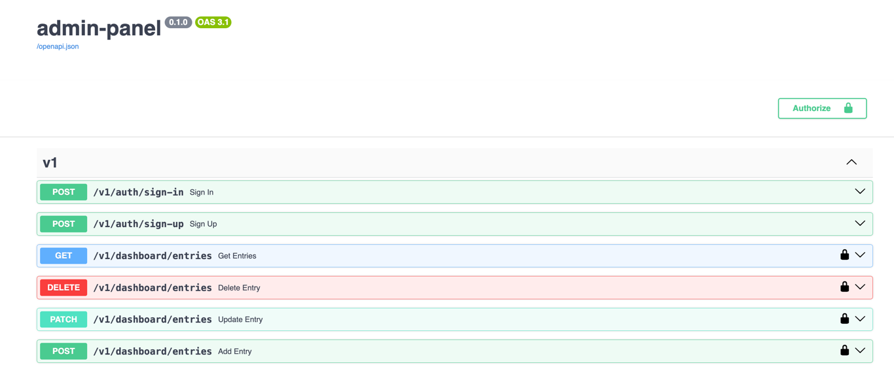
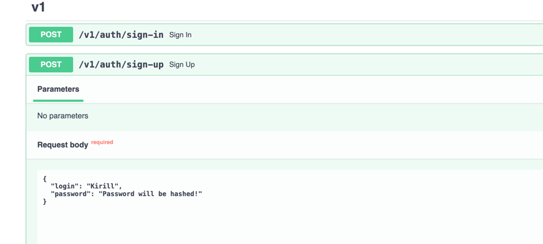
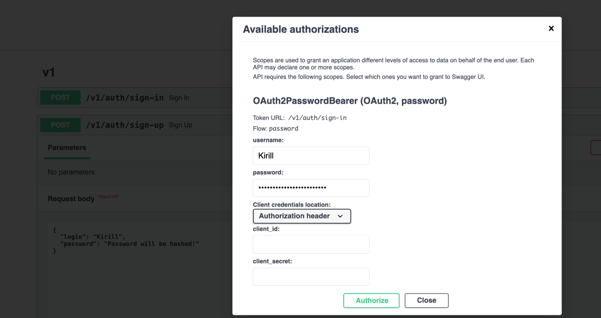

# Run in Docker
```
git clone git@github.com:kirakulakov/admin-panel.git \
&& cd admin_panel \
&& docker build -t admin_panel -f ./docker/Dockerfile . \
&& cd docker \
&& docker compose up --build
```
### And go `127.0.0.1/docs` to see the docs!

<br>


# Local

### Run server
[Require `Python 3.10+` and `PSQL-client 13+` on your local machine]
```
python -m src
```

# swagger-docs






