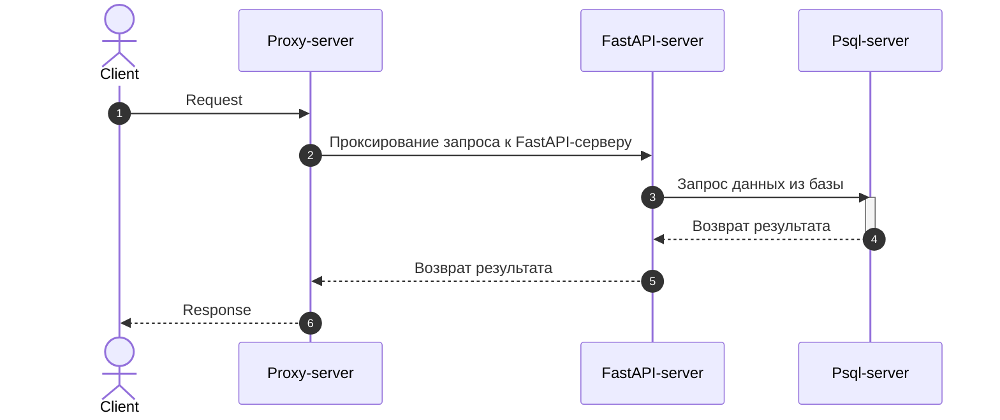

# Admin Panel



# Run in Docker
```
git clone git@github.com:kirakulakov/admin-panel.git \
&& cd admin-panel \
&& cp .env_example .env \
&& docker build -t admin_panel -f ./docker/Dockerfile . \
&& cd docker \
&& docker compose up --build -d \
&& cd ..
```
### And go `127.0.0.1/docs` to see the docs!

<br>


# Local

### Run server
[Require `Python 3.10+` and `PSQL-client 13+` on your local machine]

1. Create virtual env
```shell
python3.10 -m venv venv
```
2. Activate virtual env and install deps from requirements.txt
```shell
. ./venv/bin/activate && pip install -r requirements.txt
```
3. Create `.env` file or clone it from .env_example
```shell
cp .env_example .env
```
4. Run server
```shell
python -m src
```

# swagger-docs


